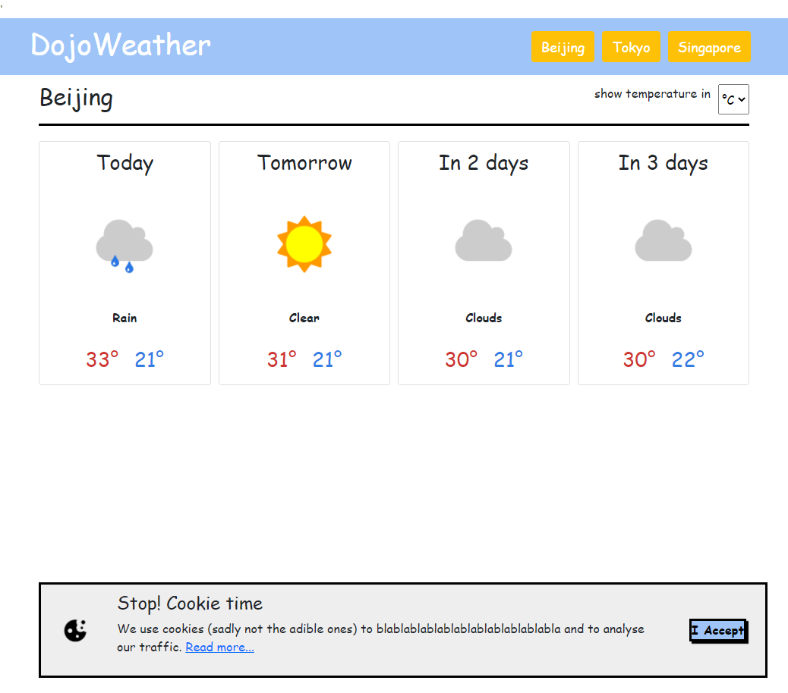

# DojoWeather
## https://login.codingdojo.com/m/172/7794/54246

* Add a click event to the city names

* When a city is clicked, make an AJAX call to the open weather API to retrieve the current weather

* Use jQuery to update the page with the current weather forecast

* NINJA bonus: Convert the temperature to Fahrenheit or Celsius when selected

