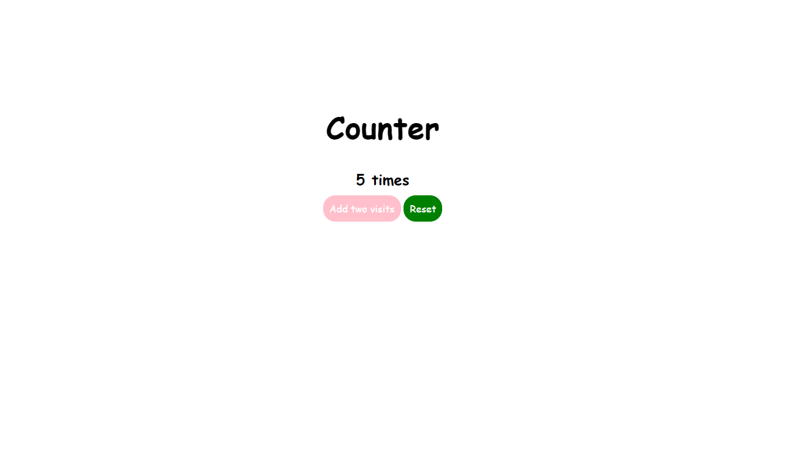

# Counter

1. Create a new Flask project called counter

2. Have the root route render a template that displays the number of times the client has visited this site. Refresh the page several times to ensure the counter is working.

3. Add a "/destroy_session" route that clears the session and redirects to the root route. Test it.

4. NINJA BONUS: Add a +2 button underneath the counter and a new route that will increment the counter by 2

5. NINJA BONUS: Add a Reset button to reset the counter

