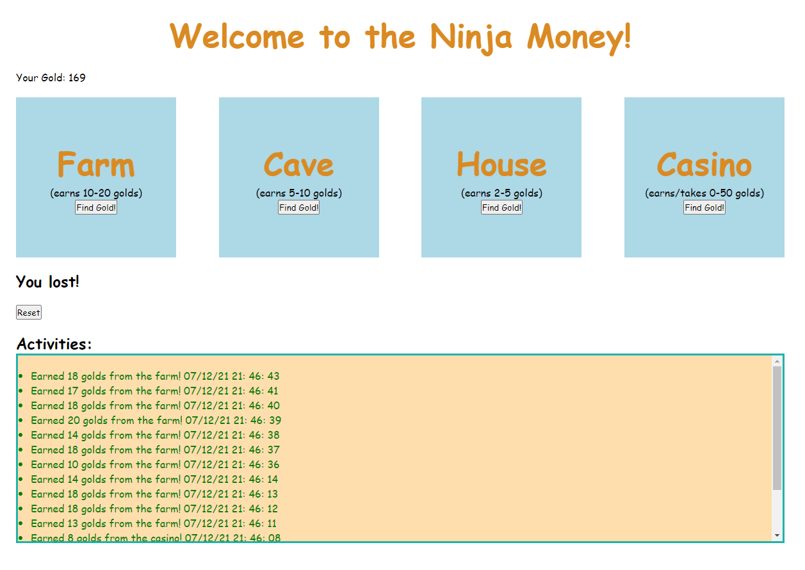

# Ninja Money

1. Create a new Flask project called ninja_gold

2. Create the template as shown in the wireframe above, with 4 separate forms

3. Have the root route render this page

4. Have the "/process_money" POST route increase/decrease the user's gold by an appropriate amount and redirect to the root route

5. NINJA BONUS: Display all the activities performed by the user in a log on the HTML, as shown in the wireframe

6. NINJA BONUS: Have the activities be color-coded as shown above (+ money is green, - money is red)

7. NINJA BONUS: Add a reset button to restart the game

8. SENSEI BONUS: Have the activities display in descending order, with the most recent activity first

9. SENSEI BONUS: Provide winning parameters to the game--for example, a user must obtain 500 gold in less than 15 moves. Only display the reset button once the user has won or lost.

10. SENSEI BONUS: Complete the "/process_money" route without 4 conditional statements (i.e. without doing if farm...elif cave...etc.)

