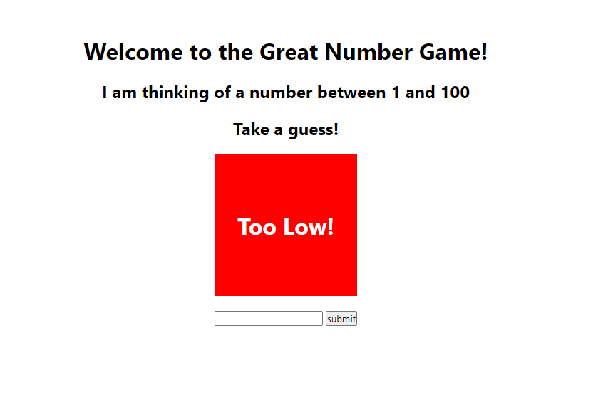
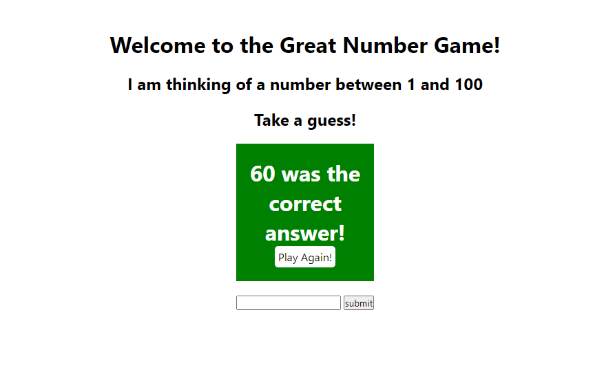

# Great Number Game

1. Create a new Flask project called great_number_game

2. In the root route, save a random number between 1 and 100 and display a form for the user to guess the number

3. Create a route that determines whether the number submitted is too high, too low, or correct. Show this status on the HTML page.

4. NINJA BONUS: Display the results as shown in the wireframe above (i.e. with appropriate colors and positioning)

5. NINJA BONUS: Allow the user to keep guessing until they get it correct

