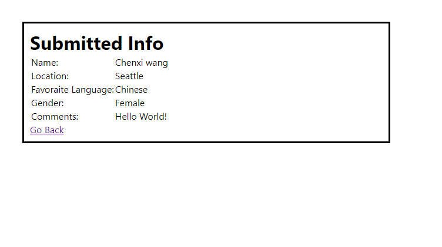

# Dojo Survey

1. Create a new Flask application

2. Have the root route ("/") show a page with the form

3. Have the "/result" route display the information from the form on a new HTML page

4. Put the form data into session

5. NINJA BONUS: Use a CSS framework to style your form

6. NINJA BONUS: Include a set of radio buttons on your form

