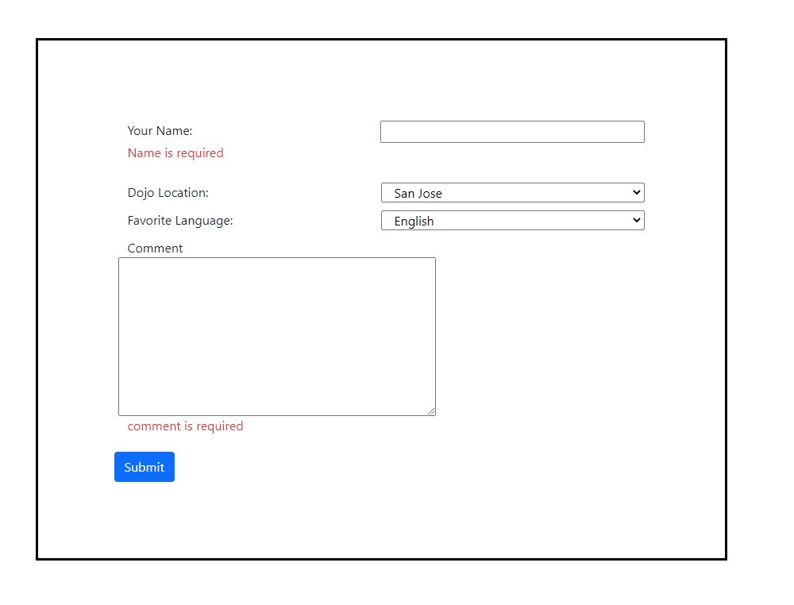

# Dojo Survey

1. Use the Dojo Survey assignment that you completed previously

2. Create a new schema called dojo_survey_schema

3. Add a dojos table with the following fields: id, name, location, language, comment, created_at and updated_at

4. Forward engineer and connect the Flask to the database

5. Add validations to make all fields required

6. Display any validation errors under the form

