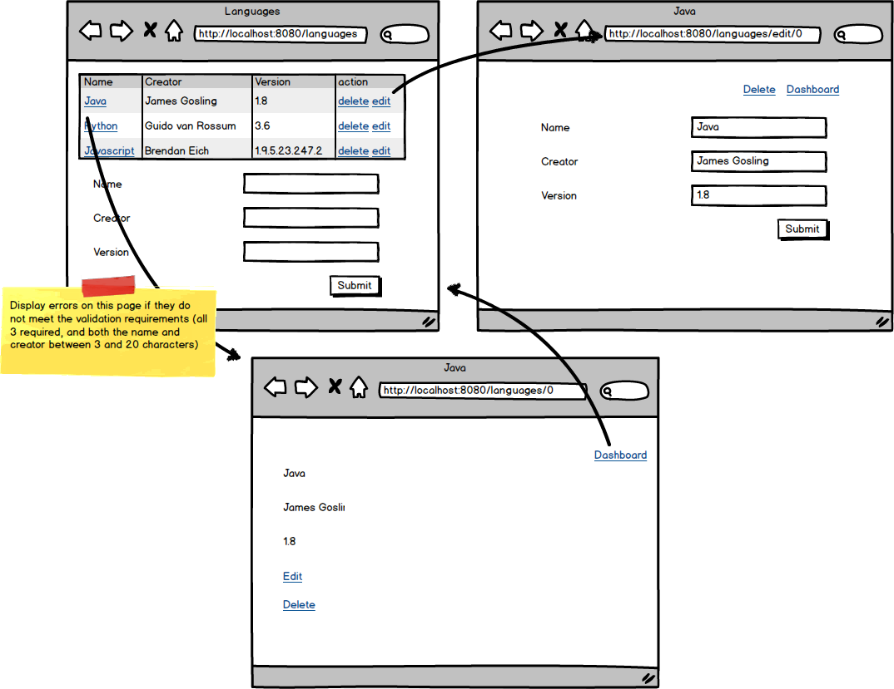
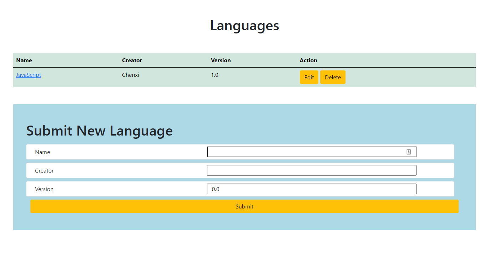
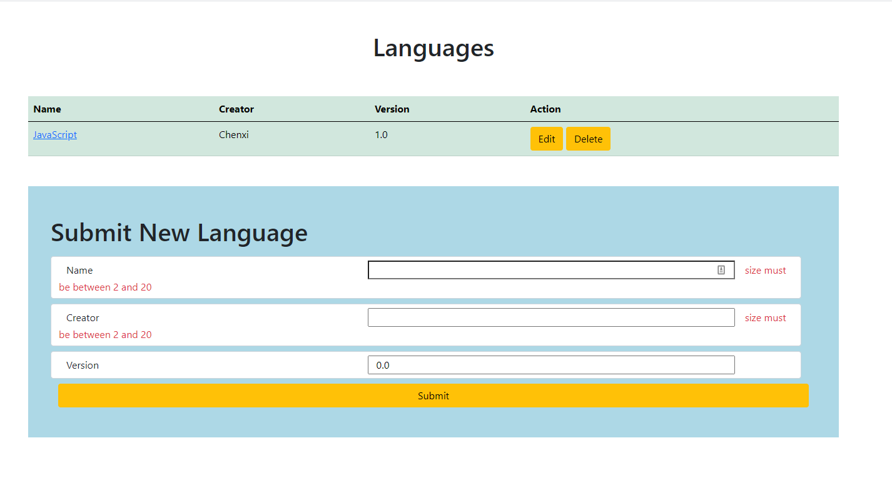
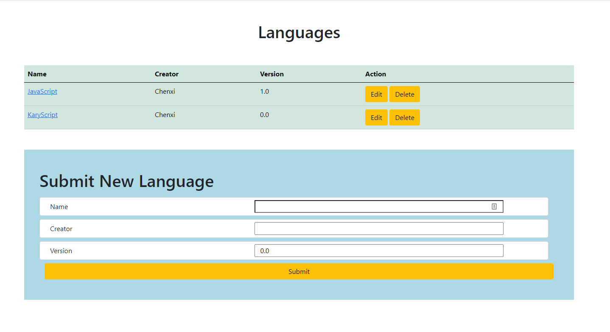
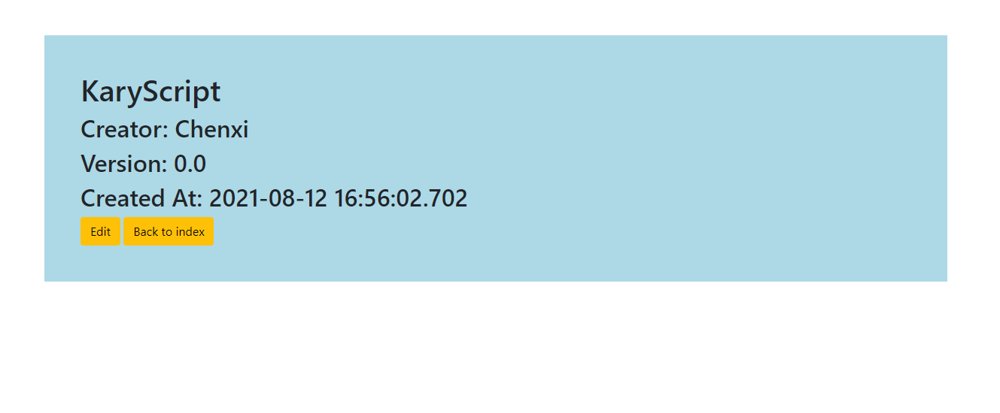
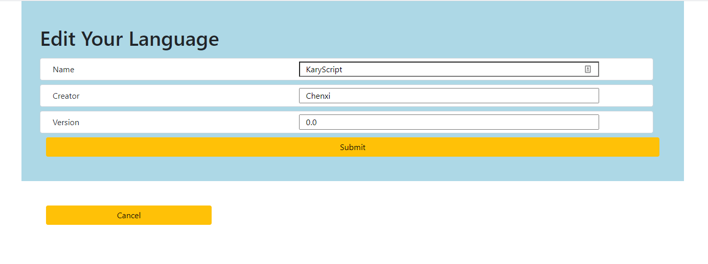

Languages
For this assignment you need to create a CRUD application for a language dashboard.
https://login.codingdojo.com/m/314/5657/37404

● name: Min char 2, Max char 20

● creator: Min char 2, Max char 20

● currentVersion: Cannot be empty

language wireframe

Topics:
● Data Persistence

● CRUD

Tasks:
● The GET /languages route should show a table of all the languages with links to edit and delete the languages; also include a form for creating new languages.

● The POST /languages routes should create a language.

● The GET /languages/{id} route should return the specific language and details.

● The GET /languages/{id}/edit route should show the edit page to of a specific language

● The PUT /languages/{id} route should should update a language

● The DELETE /languages/{id} route should delete the specific language at that id.

● All routes should be validated and show errors.

● Data must persist across reloads in a MySQL database.
