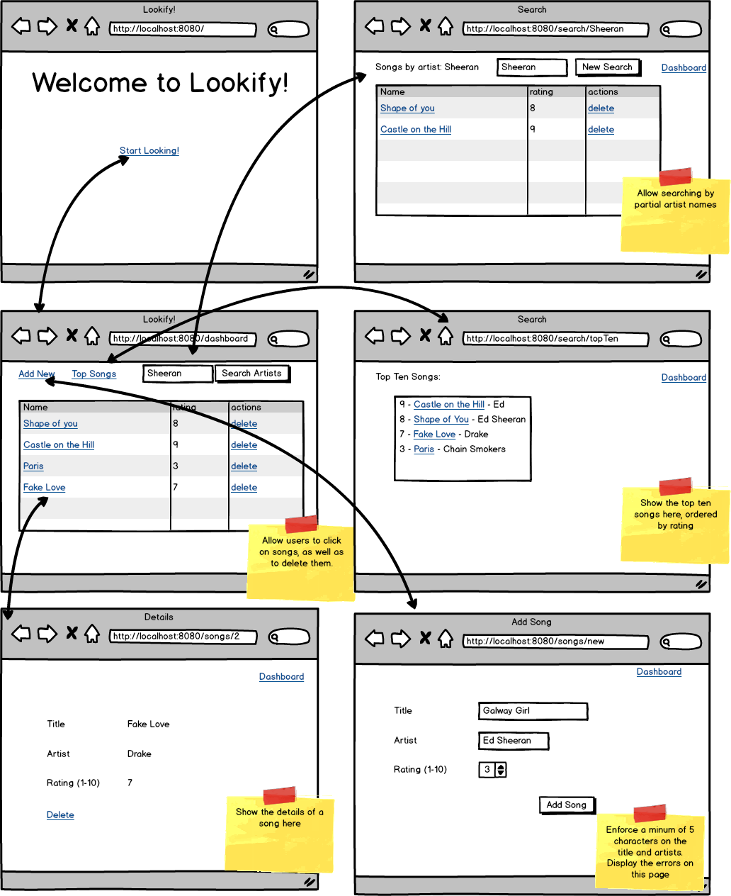

https://user-images.githubusercontent.com/56898616/129318195-5fe44732-f1bf-4b14-a3ba-9d533f66c5ca.mp4

Lookify
https://login.codingdojo.com/m/314/5657/37406

You've been asked by Lookify to help rewrite their playlist web app. Right now, it's tied up to their online store, and they want to demo something a little more lightweight. They just want you to be able to add songs to the list with:

● a title (it has to be at least 5 characters)

● an artist (it must be at least 5 characters)

● a rating (it must be a number between 1 and 10)

Aside from having the list, they also want you to be able to search the list by the artist. If the user enters incorrect information, the app must also tell them why. The description should only show when the item has been clicked on. Users should also be able to delete their items.

lookify

Topics
● CRUD

● Spring Data JPA

Tasks:
● Create an app for manipulating playlists

● Have a dashboard that shows all the songs

● Be able to delete songs from the dashboard

● Be able to add new songs on a separate page

● Be able to search by artist name for songs

● Bonus: See top ten songs in database

● have validations with error messages on song submission.
