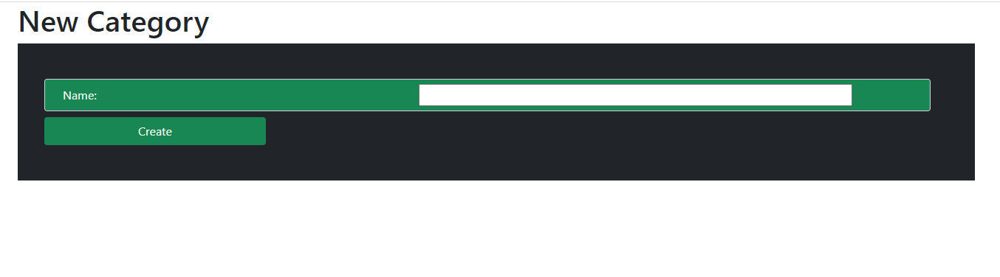

Products and Categories
https://login.codingdojo.com/m/314/5658/37415
In this assignment, you will be creating an application that will keep track of products and categories

ERD and Wireframe
manytomany

manytomany-wf

CategoryRepository
Some derived queries you may need to get you started..

    // Retrieves a list of all categories for a particular product
    List<category> findAllByProducts(Product product);

    // Retrieves a list of any categories a particular product
    // does not belong to.
    List<category> findByProductsNotContains(Product product);copy

Note: No Middle Model Needed
For this assignment you need only implement two models: Product and Category. Since there is no extra data required for the relationship, you do not need a middle model, that is, you do not need a class to handle the joiner table in the database.

Topics:
● Many-to-Many relationships

● JPA methods

Tasks (with Ninja bonus):
● Allow users to create a product.

● Allow users to create a new category.

● In the products show page, allow users to add/delete a category to a specific product.

● In the categories show page, allow users to add/delete a product to a specific category

