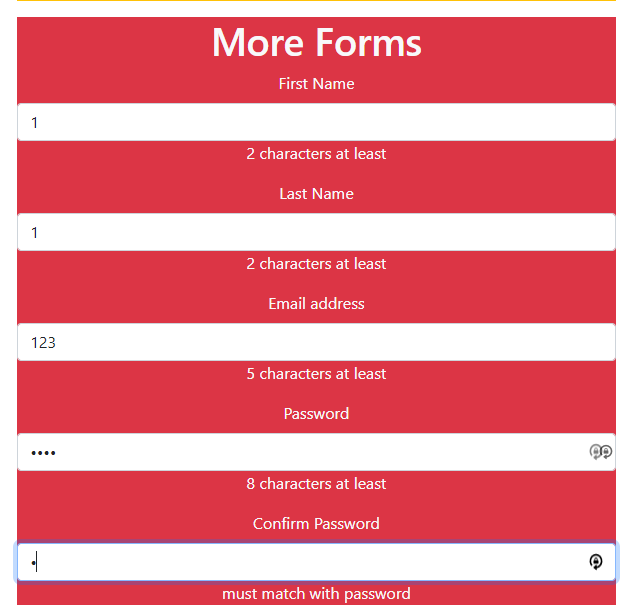
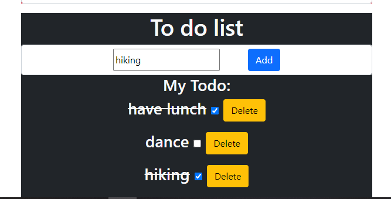

Hi there, I try to put every piece of assignment together since creating new react project takes huge resource. Thank you for your understanding.

# 1.Putting it Together

https://login.codingdojo.com/m/130/6235/43911

Using the same assignment as the Prop It Up assignment, create a birthday button that will increase one person's age by one.
<br/>


================================================

# 2. Big Inversion

https://login.codingdojo.com/m/130/6335/50225

Redo the Prop It Up assignment and turn the class components into functional components.

Create a component called PersonCard that accepts the following props:

firstName
lastName
age
hairColor
Then, display four PersonCard components that show four different people, using props.
<br/>


# 3. Hook Form

https://login.codingdojo.com/m/130/6335/45691

Create a form like the following wireframe with a React Component and hooks. Then, show in real time, the data that is being inputted into the form below
<br/>


# 4. More Forms

https://login.codingdojo.com/m/130/6335/46795

Using the previous assignment "Hook Form", add error messages.

If the First Name or Last Name is less than 2 characters, output an error message saying that field must be at least 2 characters.
If the email is less than 5 characters, output an error message saying the field must be at least 5 characters.
The passwords must match and be at least 8 characters.
These messages can appear right when you render the page, and will disappear in real time.

Hint: Use state and conditional rendering.
<br/>


# 5. Todo List

https://login.codingdojo.com/m/130/6335/48095

Ah, the todo list! A ubiquitous project for any respectable JavaScript framework. Your job is to create a small React application to store and modify a list of tasks. Each task will have a text string as well as a completed property, which will be set to false initially. As you check off items, they should appear slashed out on the page. Using what you know about state and iterating through lists, render a list of items, and give the user the option to remove each item and add new ones. There are different ways to implement the remove function. One way to do it is using the built-in filter method. Filter returns a new array when invoked and is a great way to stay true to the functional nature of React.

Hint: When updating the state, make sure to send in a brand new object or array; otherwise React won't update the view.

<br/>


# 6. Tabs

https://login.codingdojo.com/m/130/6335/48418

Develop a tabs component that will take in an array of items. Each item will have a label and a content property. When you click on each individual tab header, it should change the state of the tabs so that the correct content is displayed.

<br/>


# 7. Coin Flipping

https://login.codingdojo.com/m/130/6322/48591

Let's say we have a function that simulates flipping a coin...

```
function tossCoin() {
    return Math.random() > 0.5 ? "heads" : "tails";
}
```

And we want to use it in a function that sees how long it will take to have a coin land on "heads" five times in a row.

```
function fiveHeadsSync() {
    let headsCount = 0;
    let attempts = 0;
    while(headsCount < 5) {
        attempts++;
        let result = tossCoin();
        console.log(`${result} was flipped`);
        if(result === "heads") {
            headsCount++;
        } else {
            headsCount = 0;
        }
    }
    return `It took ${attempts} tries to flip five "heads"`;
}
console.log( fiveHeadsSync() );
console.log( "This is run after the fiveHeadsSync function completes" );
```

This will take an indeterminate amount of time. If we run the synchronous function above, it will prevent any code that comes after from running while this is taking place.

Your mission is to rewrite the above function using Promises. Make sure your fiveHeads function will call the resolve function when the coin has flipped "heads" five times in a row.

```
function fiveHeads() {
    return new Promise( (resolve, reject) => {
        // your code here!
    });
}
fiveHeads()
    .then( res => console.log(res) )
    .catch( err => console.log(err) );
console.log( "When does this run now?" );
```

<br/>


# 8. Pokemon API

https://login.codingdojo.com/m/130/6322/44711

Using the previous lesson as a starting point, create a React project that simply has a button with the text "Fetch Pokemon".

<br/>


# 9. Axios Pokemon API

https://login.codingdojo.com/m/130/6322/48250

Redo the previous assignment using axios. Using the previous lesson as a starting point, create a React project that simply has a button with the text "Fetch Pokemon".

<br/>


# 10. Routing Practice

https://login.codingdojo.com/m/130/6236/44713

Create a simple React app that can handle the following routes:

1. localhost:3000/home: This should display the home page, with a generic "Welcome" heading

2. localhost:3000/4: This should display the number "4", or any other number that was sent through

3. localhost:3000/hello: This should display the word "hello" or any other word that was sent through

4. localhost:3000/hello/blue/red: This should display the word "hello" in blue text with a red background. It should work with any other valid word and colors.

Hint: use the isNaN method (is Not a Number). For example: isNaN(+"35") is false, isNaN(+"hello") is true
