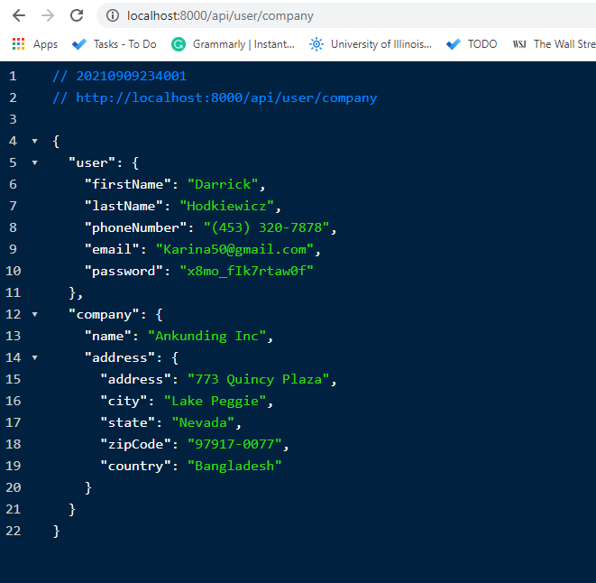
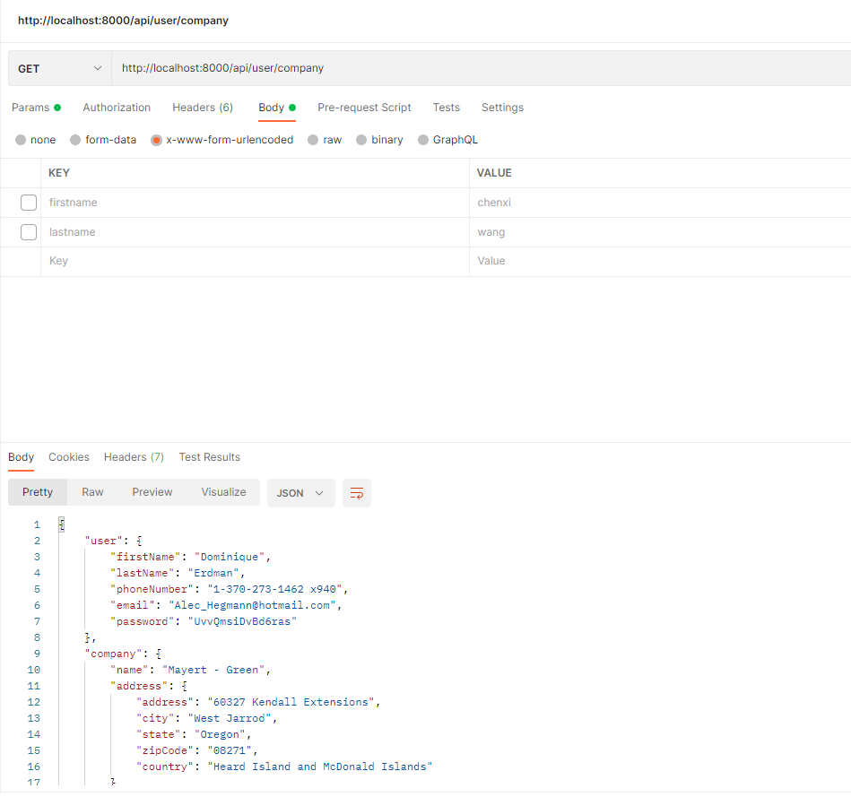

Faker API
https://login.codingdojo.com/m/130/6426/46604

To solidify the concepts of making our own api, we are going to create an api that generates a random user on a GET request. We will be using Postman to make our GET requests.

In this assignment, we will be using 2 javascript libraries to create a simple API that generates a User and/or Company depending on the route:

Express (Server)
Faker (Fake data generator)

Go ahead and follow the checklist below using the 2 classes below:

User class
\_id
firstName
lastName
phoneNumber
email
password
Company class
\_id
name
address
street
city
state
zipCode
country

Faker
The faker library has a ton of methods we can use to populate specific fields with randomly generated data. Look through the faker documentation and search through the methods to choose the ones that you would use to populate each field.

Here is an example of how we can use faker

Create a new project folder "Faker_API" and with your terminal, navigate into your new folder

Create a package.json file using the "npm init -y" command in your terminal

install express and faker

Create a server.js file

In your server.js file, Import express and faker

Create 2 classes: User, Company with the same attributes as listed above

Create an api route "/api/users/new" that returns a new user

Create an api route "/api/companies/new" that returns a new company

Create an api route "/api/user/company" that returns both a new user and a new company

Run your server.js file using nodemon

Using Postman, test your new GET routes
 

