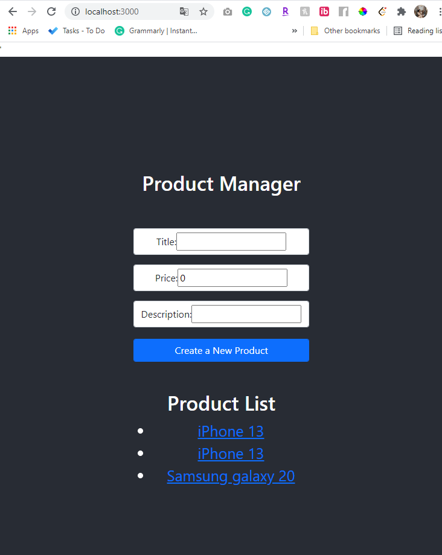
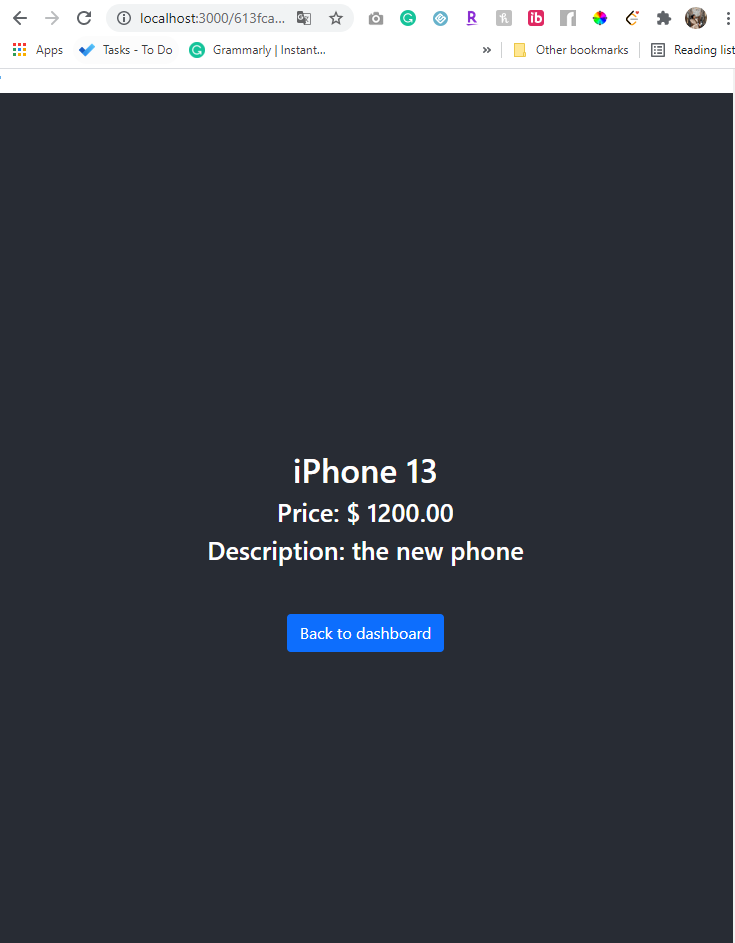
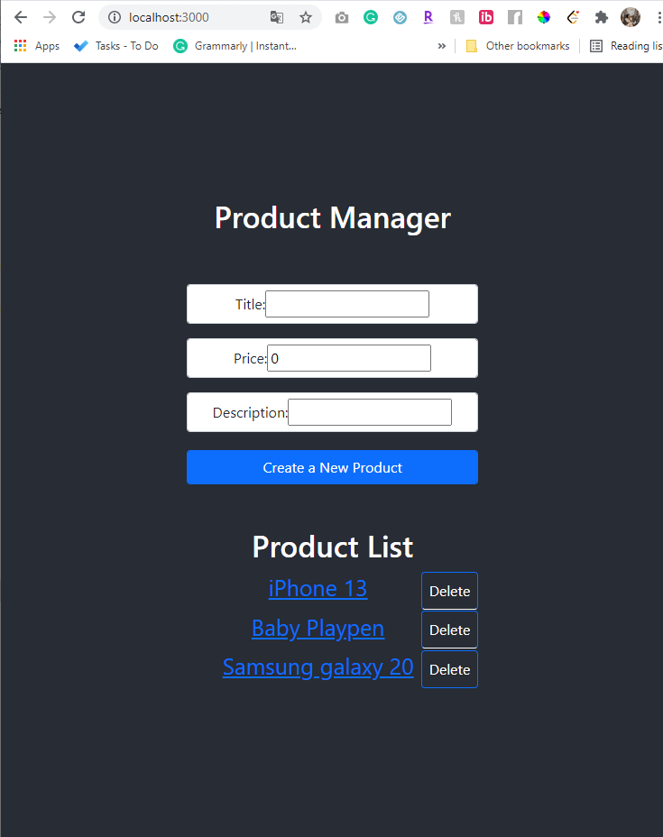
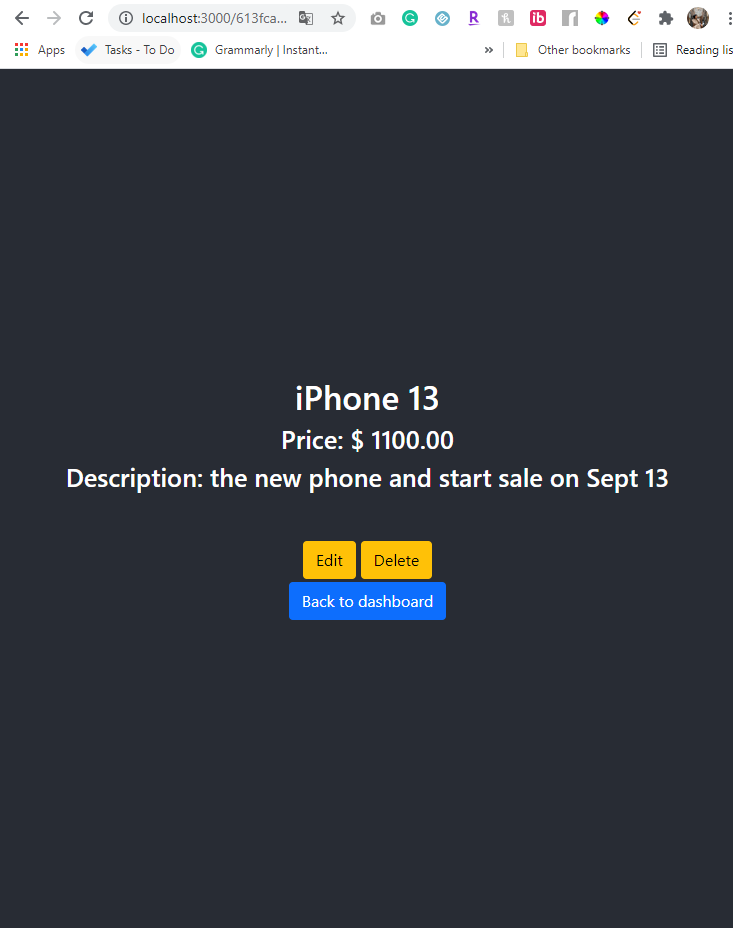
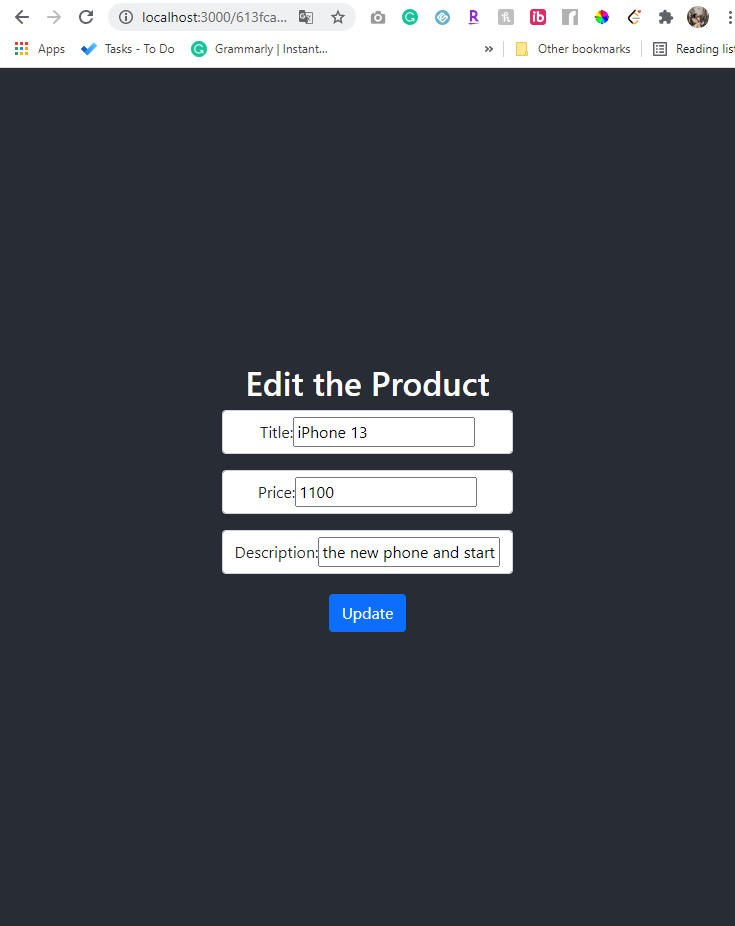

# Product Manager (Part I)

https://login.codingdojo.com/m/130/6429/48231

Create a full stack MERN project that will become a complete product manager.

Note: We will be using this project for the next couple of assignments as well, so keep that in mind as you are building it.

In this assignment, you will add the ability to create a new product on the main page of the app.

1. Create your MERN stack folder structure

2. Create your server, model, controller, routes, and config files for your server

3. On the client end ==> Create a form component so that your Product can have a title, price and description

4. Check in your database that your products are being added

# Product Manager (Part II)

https://login.codingdojo.com/m/130/6429/48233

Continue from the previous assignment. On the main page, below the product form, list out all of your products in your database. Then, create a route so that you can see the specifics for a particular product.

1. Create a component to list out all products on your main page

2. Create a new view component that will let you see the details of a particular product (localhost:3000/:id)

3. Link to the detail page in the list of products

 

# Product Manager (Part III)

https://login.codingdojo.com/m/130/6429/48236

Update Product Manager so that you can update and delete your products.

1. Add the route localhost:3000/:id/edit that will include an autofilled form to edit a given product.

2. Add a delete button in the List component as well as the detail component that will delete the product from the database

3. After you delete the product from the Detail component, redirect to the main view

4. After you delete the product from the main view, update the DOM so that the product is removed.

 

